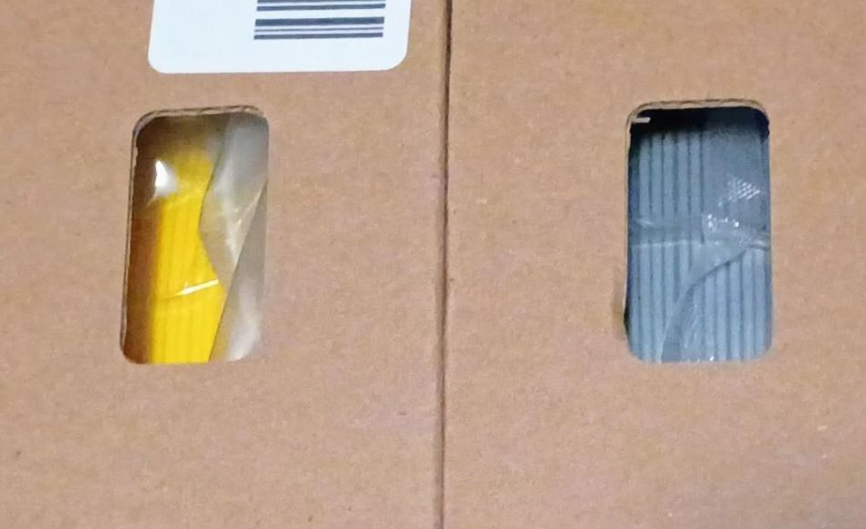
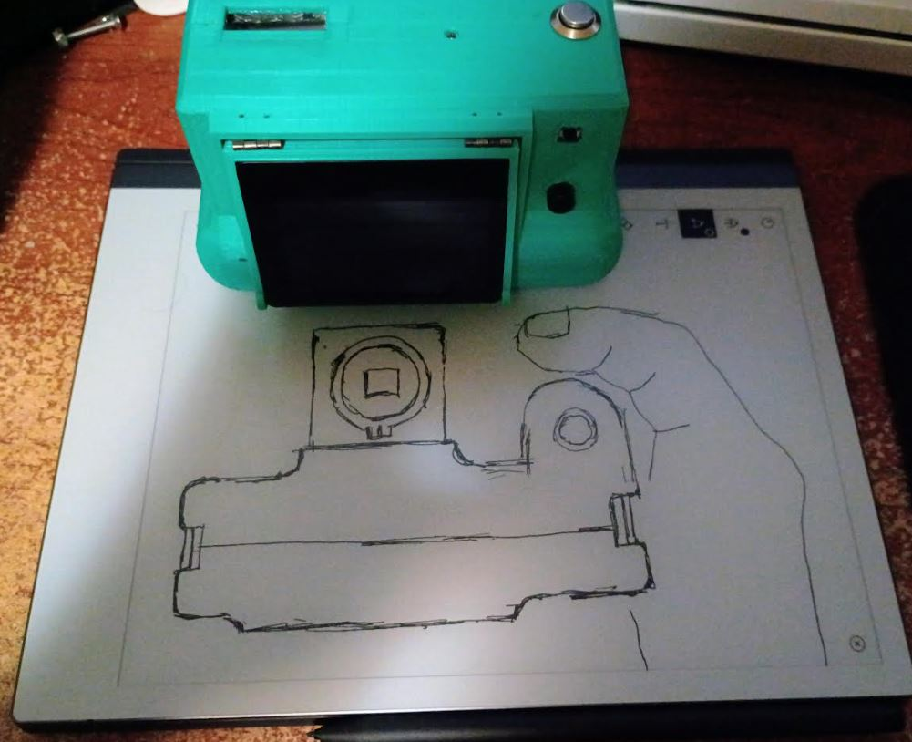
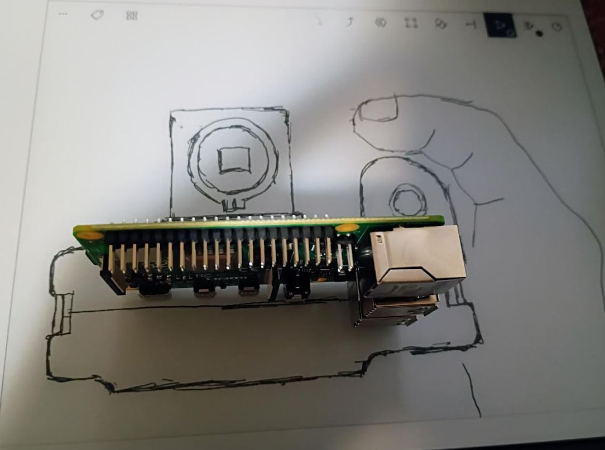
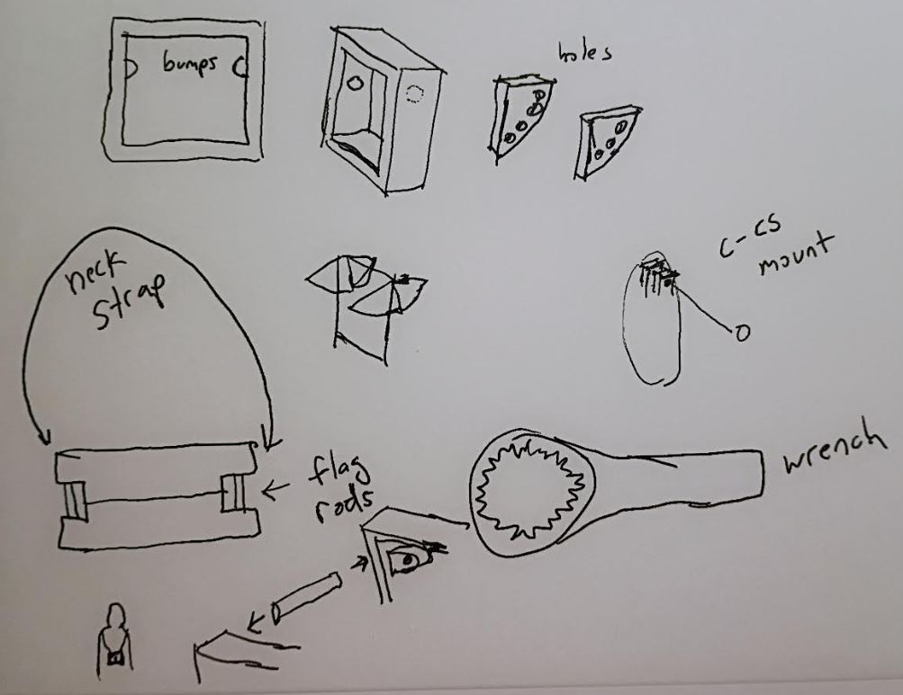
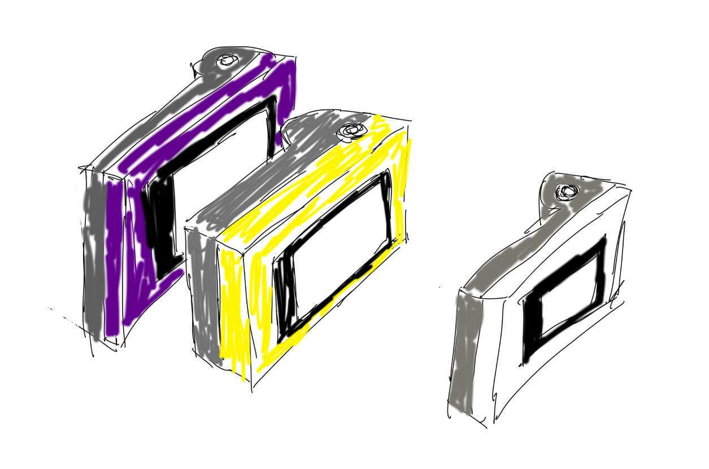
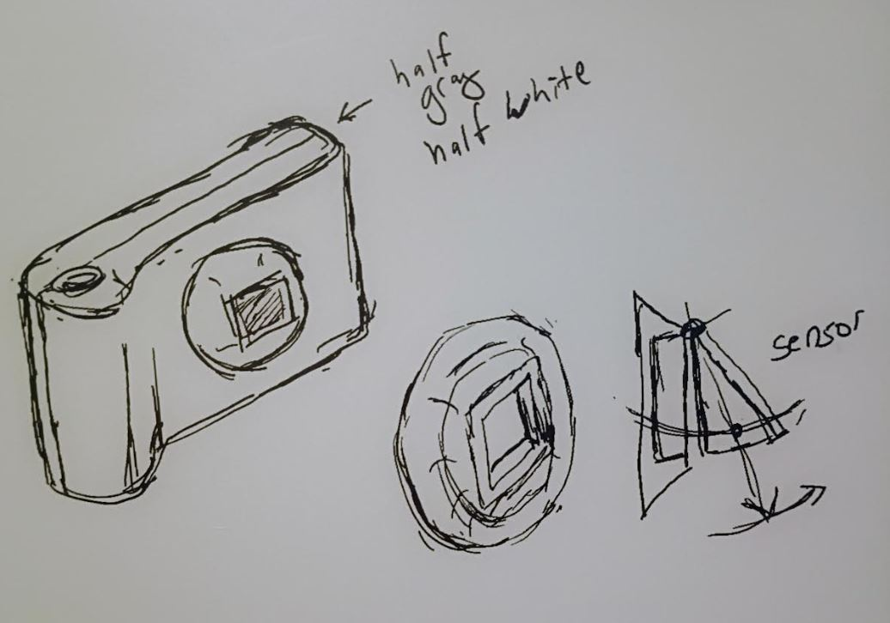
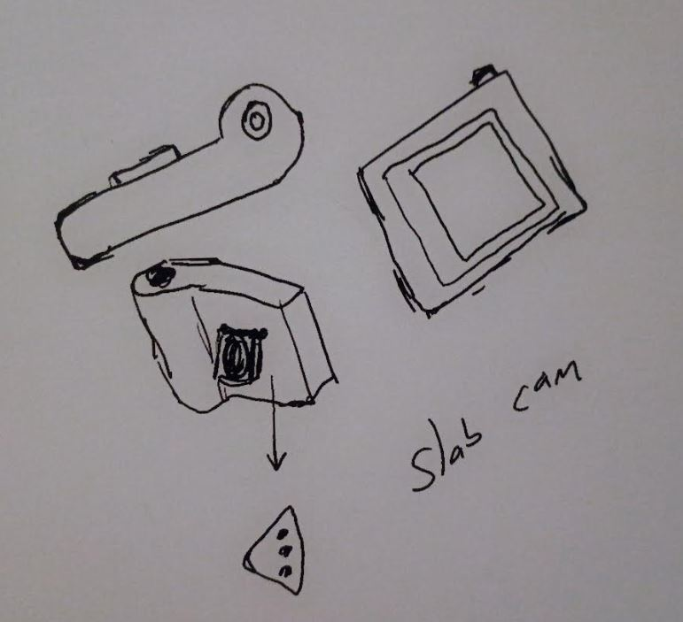

- [ ] make wrench for C-CS adapter

### 03/03/2026

6:44 PM

Geting some parts in

Mmm grey in the front, yellow in the back

I also got the 3000mAh single cell lipos in damn they are fat

8:05 PM

It's funny I feel bad that these RPi's have 4GB of ram, it's a complete waste... the current code barely runs near 500 MB so going forward unless it'll run an LLM I'm trying to use the 1GB RPis.

Can see this camera looks more like a normal camera.

Except that the sensor flips out.

---

### 03/02/2026

6:12 PM

While I am pretty busy, 40hr week day job, trying to launch an app like a startup, I am still gonna build new cameras like this one. Today I had this thought of a camera a month but that's a little excessive. So I think I can do one every 2 months... I have at least 5 other cameras including this one, all unique in their own way/purpose.

I ordered the parts for this one so I'll have this camera built before April ends.

I ordered 3 more lenses... so I kinda spent more money there than I should have. I am using parts I already have for this camera so this one for example will use an Arducam IMX477 that I already have. It'll be overpowered with a 2GB Pi 4B, I decided it can use 1GB ram if using a DSI display.

One of the cameras will have a mic/speaker and an on-board LLM so that one will need a higher RAM board.

This particular purpose is giving the camera "life". It should have an IMU as well so it can feel itself moving.

They say you should use 8GB RAM but I'll try to use 4GB... idk, the thing is it's not doing much it's primarily for talking, I'm still unsure what it will do.

8GB for some reason seems excessive and the price is almost double the 4GB version at $75.

But... might as well commit ha.

6:48 PM

The main reason I wanted to make another camera after the blue-green one (JDC34) is the flange not being adjustable... that was kind of a fail on my part although I had a specific design/vision in mind.

So the newer cameras if using the HQ cam will have adjustable flanges (meaning the flat head screw is accessible).

JDC34 is such a neat camera though how bulky it is and the angle on the display vs. the roundess of the body

Oh yeah, I'm gonna design some kind of 3D printed rench thing that can clamp/twist the C-CS adapter without damaging it (from metal pliers)

It actually could just be a circle thing you put over the C-CS adapter

Like a magnifying glass with geared circumference

11:01 PM

This is the ratcheting sensor tilt mechanism and also neck strap rods

---

### 02/23/2026

8:50 PM

Put the push button switch on top-left, no on back plate

back plate top-left

I'm going with the push button switches because the slide ones are cheap/break

---

### 02/22/2026

8:47 AM

I'm going to design this camera, I'm sold on the grey and yellow design (back plate is yellow)

It's going to be much simpler hardware wise

No IMU, no secondary screen, no physical buttons except the shutter

The other thing I want is a bluetooth mobile app so the photos are immeidately transferred to my phone upon being taken

That way the device is kind of disposable in a way

It's still expensive but after seeing the 640x480 resolution it's tough to go back to a SPI display. The DSI display is brighter too.

I could get by the low resolution using OSD focus hints eg. laplace variance number or that FocusFOM

I'm also thinking this sensor (and lenses) in my experience seems to be more suitable for street photography and buildings (big objects with the same color)

Where I live too, it's kind of boring nature/landscape wise so I think it will be good when I get more brave and go into towns/downtown areas

But yeah, I'm going to get Pi 4B 1GB RAM, it still seems stupid to use a full computer but it interfaces with all the parts as is

But the price will go down, if I use less/cheaper parts, like the SD card instead of 128GB I can just a 32GB one.

8:52 PM

I won't build this new camera until I finish Pelicam though

That includes both DSI display and SPI display

---

### 02/19/2026

8:31 PM

Thinking about colors

This camera physicall/externally will be really simple, one physical button that is the shutter

The display doesn't fold out but the sensor does, if you want to do a low photo of say a flower, you can flip the sensor upwards and then look down at your camera's screen

Thinking about colors, I'm thinking of doing a split color like the pi-ro cam

This also will not use an 18650 battery, it'll use a flat cell

So the handle is purely for ergonomics/not housing an 18650 cell

---

### 02/17/2026

8:40 PM

I'm hung up on this tilting sensor, mostly so you can look down at the display

I also thought of this raised/flange thing circular

---

### 02/13/2026

6:23 PM

This is kind of bad but I'm already designing new cameras...

A major "flaw" in the JDC34 camera is the sensor being inside the body...

You can't adjust the flat plate so that lenses are naturally focused (without unscrewing)

Granted every lens design varies and if I focus for one, I don't focus for the other...

The other thing I want to address is making a really simple camera hardware wise where I can fully document it

Assembly and software

This one in particular it focuses on the touchscreen display as I've realized with the JDC34 camera that it's kind of redundant

To have physical buttons aside from the shutter when you have a touch screen.

The JDC34 camera is also a lot harder to build and doesn't have the seam when joining the two halves

And as someoned point out the JDC34 camera is hard to hold, like the shape is odd

It's not hard to hold but it's not ergonomic for sure

Some doodles I've had

I'll finish the JDC34 camera software before I start this project

This one is really going on the hand-held concept

But the other piece is, the sensor is on a hinge, so while the dispay doesn't move against the body (no hinge)

The sensor does and it'll use these bump/ratchet things (plastic) to provide resistance/hold the hinge in place

It has one physical button, the shutter
